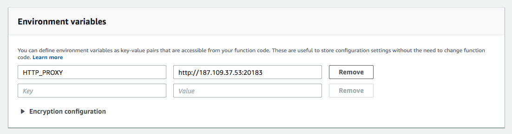

# Consulta Placa

[](http://www.serverless.com)
[](#contribuição)

AWS Lambda de exemplo para consultar placa de veículos na base do SINESP.

## Instalação

`yarn install` ou `npm install`

---

## Executar em ambiente de desenvolvimento

`yarn start` ou `npm run start`

```sh
> sls offline start

Serverless: Starting Offline: dev/us-east-1.

Serverless: Routes for consultaPlaca:
Serverless: GET /placa/{placa}

Serverless: Offline listening on http://localhost:3000
```

Acesse `http://localhost:3000/placa/ABC1020` informando a placa para consulta desejada.

```json
{
  "codigoRetorno": "0",
  "mensagemRetorno": "Sem erros.",
  "codigoSituacao": "0",
  "situacao": "Sem restrição",
  "modelo": "VW/GOL LS",
  "marca": "VW/GOL LS",
  "cor": "Cinza",
  "ano": "1982",
  "anoModelo": "1982",
  "placa": "ABC1020",
  "data": "08/04/2019 às 08:21:02",
  "uf": "PR",
  "municipio": "COLOMBO",
  "chassi": "00509",
  "dataAtualizacaoCaracteristicasVeiculo": "22/02/2019",
  "dataAtualizacaoRouboFurto": "07/04/2019",
  "dataAtualizacaoAlarme": "07/04/2019"
}
```

---

## Invocar a função em desenvolvimento para testar chamadas

https://serverless.com/framework/docs/providers/aws/cli-reference/invoke-local/

`yarn dev:invoke` ou `npm run dev:invoke`

```sh
sls invoke local -f consultaPlaca -p ./placas/sem-restricao.json
{
    "statusCode": 200,
    "headers": {
        "Access-Control-Allow-Origin": "*",
        "Access-Control-Allow-Credentials": true
    },
    "body": "{\"codigoRetorno\":\"0\",\"mensagemRetorno\":\"Sem erros.\",\"codigoSituacao\":\"0\",\"situacao\":\"Sem restrição\",\"modelo\":\"I/FERRARI 360 MODENA\",\"marca\":\"I/FERRARI 360 MODENA\",\"cor\":\"Vermelha\",\"ano\":\"1999\",\"anoModelo\":\"2000\",\"placa\":\"AFT0017\",\"data\":\"08/04/2019 às 08:38:47\",\"uf\":\"PR\",\"municipio\":\"QUATRO BARRAS\",\"chassi\":\"15765\",\"dataAtualizacaoCaracteristicasVeiculo\":\"22/02/2019\",\"dataAtualizacaoRouboFurto\":\"07/04/2019\",\"dataAtualizacaoAlarme\":\"07/04/2019\"}"
}
sls invoke local -f consultaPlaca -p ./placas/roubo-furto.json
{
    "statusCode": 200,
    "headers": {
        "Access-Control-Allow-Origin": "*",
        "Access-Control-Allow-Credentials": true
    },
    "body": "{\"codigoRetorno\":\"0\",\"mensagemRetorno\":\"Sem erros.\",\"codigoSituacao\":\"1\",\"situacao\":\"Roubo/Furto\",\"modelo\":\"I/MMC L200 4X4\",\"marca\":\"I/MMC L200 4X4\",\"cor\":\"Preta\",\"ano\":\"1992\",\"anoModelo\":\"1993\",\"placa\":\"FFF0012\",\"data\":\"08/04/2019 às 08:38:55\",\"uf\":\"SP\",\"municipio\":\"SAO PAULO\",\"chassi\":\"01561\",\"dataAtualizacaoCaracteristicasVeiculo\":\"22/02/2019\",\"dataAtualizacaoRouboFurto\":\"07/04/2019\",\"dataAtualizacaoAlarme\":\"07/04/2019\"}"
}
sls invoke local -f consultaPlaca -p ./placas/invalida.json
{
    "statusCode": 500,
    "headers": {
        "Access-Control-Allow-Origin": "*",
        "Access-Control-Allow-Credentials": true
    },
    "body": "{\"codigoRetorno\":\"1\",\"mensagemRetorno\":\"Placa inválida.\"}"
}
sls invoke local -f consultaPlaca -p ./placas/nao-encontrada.json
{
    "statusCode": 500,
    "headers": {
        "Access-Control-Allow-Origin": "*",
        "Access-Control-Allow-Credentials": true
    },
    "body": "{\"codigoRetorno\":\"3\",\"mensagemRetorno\":\"Veículo não encontrado.\"}"
}
```

---

## Publicar em produção na AWS

Crie as credenciais de acesso na AWS
https://serverless.com/framework/docs/providers/aws/guide/credentials/

Execute o comando abaixo e assim que terminar de publicar será retornado a url para acesso a função em produção:

`yarn prod:deploy` ou `npm run prod:deploy`

```sh
> sls deploy -s production
...
endpoints:
  GET - https://XXXXXXXXXX.execute-api.us-east-1.amazonaws.com/production/placa/{placa}
```

Caso você recebam algum erro ao fazer a chamada em produção como:

```json
{
  "error": {
    "code": "ECONNRESET",
    "errno": "ECONNRESET",
    "syscall": "read"
  }
}
```

É necessário criar uma variável de ambiente `HTTP_PROXY` pois o SINESP bloqueia alguns acessos.



Existem diversos sites com lista de proxy gratuito hospedado no Brasil, exemplo: https://www.proxydocker.com/pt/proxylist/city/S%C3%A3o%20Paulo

---

## Remover função da AWS

`sls remove -s production`

```sh
Serverless: Getting all objects in S3 bucket...
Serverless: Removing objects in S3 bucket...
Serverless: Removing Stack...
Serverless: Checking Stack removal progress...
...........
Serverless: Stack removal finished...
```

## Documentação

https://serverless.com/framework/docs/

## Créditos

Esse exemplo utiliza o package [sinesp-nodejs](https://github.com/bbarreto/sinesp-nodejs) criado pelo [@bbarreto](https://github.com/bbarreto)

## Contribuição

Se você quer melhorar esse exemplo basta enviar um [Pull Request](https://github.com/wgenial/consulta-placa-serverless/compare) ✌️

## Licença

[MIT](https://github.com/wgenial/consulta-placa-serverless/blob/master/LICENSE.md)

## Observação

Este projeto não possui nenhum vínculo oficial com o Sistema Nacional de Informações de Segurança Pública (SINESP). O software é disponibilizado da forma como está aqui e não há garantias que ele irá funcionar sempre. Como a API do SINESP não é publicamente documentada, esta biblioteca pode parar de funcionar a qualquer momento sem aviso prévio.
